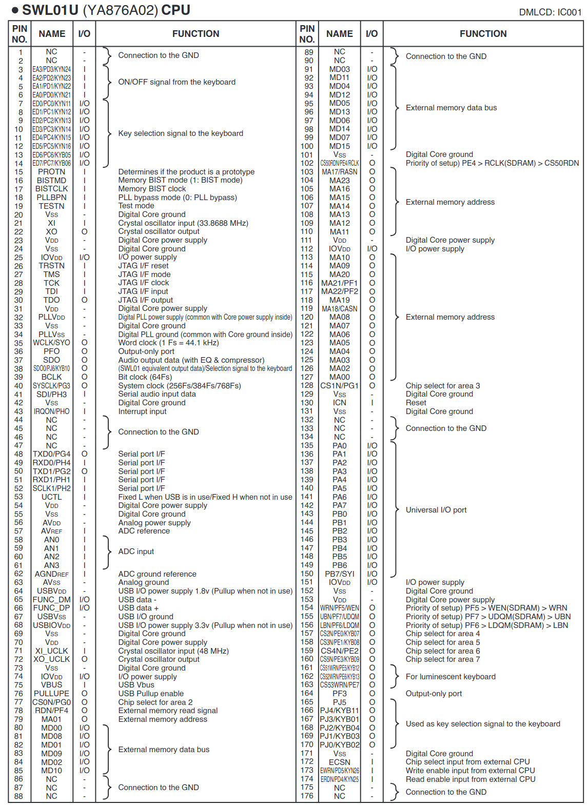

# Yamaha SWL01U
A result of a reverse engineering attempt for the aforementioned chip found in
some entry-level Yamaha digital keyboards (like the PSR-E433 that I own). On a
personal note, this is my first reverse engineering project.

## Chip overview
  - Release date: circa 2009
  - Package: 176-pin TQFP
  - CPU: ARM7TDMI w/ JTAG interface
  - Memory:
    - Internal 64 KiB ROM
    - Internal ? KiB SRAM
    - External memory bus (16-bit data, 24-bit address, 4 CS lines)
      - 16 MiB flash (PSR-E433)
      - 2 MiB SDRAM (PSR-E433)
      - Master and slave modes
  - GPIO: 9 x 8-bit ports (PORTA-PORTH, PORTJ). Not all of the bits are exposed.
  - ADC: 4 channels
  - I2S: input and output
  - UART: 2x
  - USB slave controller
  - Clock: two external oscillators (core @ 33.8688 MHz and USB @ 48 MHz);
    internal PLL
  - Hard-logic DSP

## Repo overview
  - `images/`: Memory dumps
    - `rom.bin`: Internal ROM
    - `flash.bin`: External flash (PSR-E433)
  - `swl01u.gpr`, `swl01u.rep/`: Ghidra project for the ROM, bootloader and
    firmware
  - `openocd.cfg`, `.gdbinit`: Configuration for the respective tools for JTAG
    debugging
  - `unfuckify.py`: Reverses endianness in flash dumps (workaround for what
    appears to be bug somewhere)
  - `shell.py`: Accesses a shell over MIDI SysEx messages that's present in the
    firmware
  - `fun/`: Various fun things (such as Bad Apple). The code quality is terrible
    at the moment.

## Detailed information

### Pinout
Taken from the PSR-E443 Service Manual (not to be confused w/ PSR-E433):



### JTAG
The chip exposes a JTAG interface on pins 26 (TRSTN), 27 (TMS), 28 (TCK), 29
(TDI) and 30 (TDO). This interface appears to be unprotected and always enabled.

### Images
Yamaha appears to be using a uniform format for all of their images. All images
are multiples of 4 KiB in size (the size of a flash block). The last 48 bytes of
all images contain a footer:
```
end-48:  53 57 4c 30 31 55 20 49  6e 74 65 72 6e 61 6c 00  |SWL01U Internal.| <- Image name (optional)
end-32:  ff ff ff ff ff ff 31 30  31 32 30 30 39 46 45 42  |......1012009FEB| <- Version (101), Year (2009), Month (FEB)
end-16:  31 36 30 37 35 30 32 33  0f 6f 0d e6 71 ff f2 ff  |16075023.o..q...| <- Day of month (16), Time (07:50:23), Checksum
```

I was not interested in reversing the checksum algorithm (performed by the
`check_image` function).

### Memory map
  - `0x00000000` - `0x0000ffff` (64 KiB): Internal ROM
  - `0x01000000` - ?: Internal SRAM
  - `0x02000000` - `0x02ffffff` (16 MiB): External; Prog/Wave flash on PSR-E433
  - `0x04000000` - `0x041fffff`: External; User flash on PSR-E433?
  - `0x05000000` - ?: External; USB HCI on PSR-433?
  - `0x06000000` - `0x061fffff` (2 MiB): External; SDRAM on PSR-E433
  - `0xf0000000` - `0xffffffff`: Peripherals
    - `0xfd000000`: USB slave controller
    - `0xfe000000`: Tone generator
    - `0xff000000`: GPIO

### Dump contents

#### Internal ROM
`images/rom.bin`:
  - `0x00000000` - `0x0000bfff` (48 KiB): Firmware ("SWL01U Internal", v. 101, 2009 Feb 16, 07:50:23)
  - `0x0000c000` - `0x0000ffff` (16 KiB): Unused

The ROM contains interrupt vectors that pretty much directly jump into the
flash area. It also contains several helper functions, including parts of what
appears to be an RTOS, with the rest contained in the flash.

#### External flash
`images/flash.bin`:
  - `0x00000000` - `0x00020000` (128 KiB): Bootloader ("12PSR-EH BOOT", v. 100, 2012 Mar 20, 00:13:07)
  - `0x00020000` - `0x00190000` (1472 KiB): Firmware ("12PSR-EH MAIN", v. 102, 2012 May 16, 19:00:57)
  - `0x00190000` - `0x00339000` (1700 KiB): Style (v. 100, 2012 Feb 09, 08:18:02)
  - `0x00339000` - `0x00367000` (184 KiB): Pattern (v. 100, 2012 Feb 09, 08:18:02)
  - `0x00367000` - `0x00542000` (1900 KiB): Song (v. 100, 2012 Feb 09, 08:18:03)
  - `0x00542000` - `0x0060a000` (800 KiB): Param (v. 101, 2012 Feb 14, 08:06:56)
  - `0x0060a000` - `0x01000000` (10200 KiB): Wave (v. 101, 2012 Feb 14, 08:06:57)

The bootloader is capable of updating flash contents. The firmware appears to be
running an RTOS and calling into the ROM for some helper functions (incl. parts
of the RTOS).

It also includes an interactive shell that transfers characters over MIDI SysEx
messages over USB.

### Register map

#### `0xff100000`: `GPIO_ABCD`
#### `0xff110000`: `GPIO_DIR_ABCD`
#### `0xff200000`: `GPIO_EFGH`
